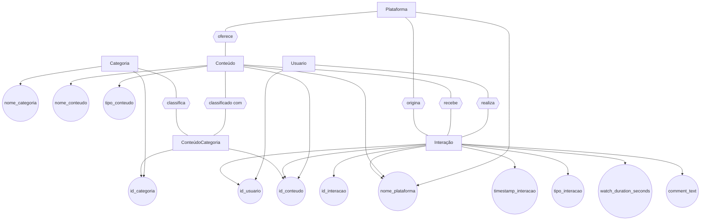
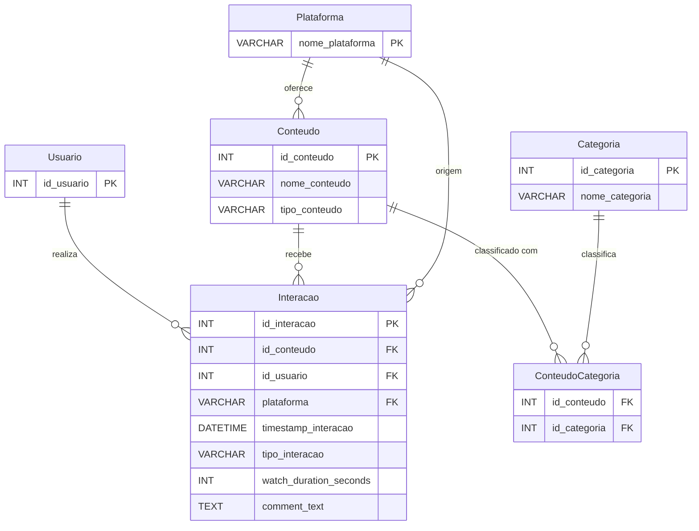

# Funcionalidades e Complexidade Algorítmica

## Carregamento e Processamento

| Método                                  | Descrição                                    | Complexidade  |
|----------------------------------------|----------------------------------------------|----------------|
| `carregar_interacoes_csv(caminho_arquivo)` | Lê o CSV e enfileira cada linha              | **O(n)**        |
| `processar_interacoes_da_fila()`       | Cria objetos e insere nas BSTs               | **O(m log n)**  |

---

## Relatórios de Conteúdo

| Método                                         | Função                               | Complexidade     |
|------------------------------------------------|---------------------------------------|------------------|
| `gerar_relatorio_engajamento_conteudos(top_n)` | Relatório geral de engajamento        | **O(n log n)**   |
| `relatorio_top_conteudos_consumidos(n)`        | Ranking por tempo assistido           | **O(n log n)**   |
| `relatorio_conteudos_mais_comentados(top_n)`   | Ranking por comentários               | **O(n log n)**   |
| `relatorio_top_conteudos_mais_visualizados(n)` | Ranking por views                     | **O(n log n)**   |
| `relatorio_top_conteudos_mais_curtidos(n)`     | Ranking por curtidas                  | **O(n log n)**   |
| `relatorio_conteudos_ordenados_por_nome(ordem)`| Ordenação alfabética                  | **O(n log n)**   |
| `relatorio_total_interacoes_por_tipo_conteudo()`| Agrupamento por tipo de conteúdo      | **O(n)**         |
| `relatorio_comentarios_por_conteudo()`         | Comentários por conteúdo              | **O(n + c)**     |

---

## Relatórios de Usuários

| Método                                      | Função                            | Complexidade   |
|--------------------------------------------|------------------------------------|----------------|
| `gerar_relatorio_atividade_usuarios(top_n)`| Atividade por usuário              | **O(u)**       |
| `usuario.calcular_tempo_total_consumo()`   | Soma tempo de consumo por usuário  | **O(k)**       |

---

## Relatórios de Plataforma

| Método                                             | Função                            | Complexidade     |
|----------------------------------------------------|-----------------------------------|------------------|
| `relatorio_plataforma_maior_engajamento()`         | Plataforma com mais interações    | **O(n × i)**     |
| `relatorio_tempo_medio_consumo_por_plataforma()`   | Tempo médio assistido por plataforma | **O(n × i)**  |
| `relatorio_distribuicao_interacoes_por_plataforma()`| Tipos de interação por plataforma | **O(n × i)**     |

---

## Buscas e Filtros

| Método                                      | Função                             | Complexidade   |
|--------------------------------------------|------------------------------------|----------------|
| `buscar_conteudo_por_nome(texto)`          | Busca de conteúdos pelo nome       | **O(n)**       |
| `buscar_conteudos_por_plataforma(nome)`    | Conteúdos associados à plataforma  | **O(n × i)**   |

---

## Recomendação

| Método                                      | Função                                  | Complexidade     |
|--------------------------------------------|------------------------------------------|------------------|
| `recomendar_conteudos_por_categoria()`     | Ranking por engajamento e tempo assistido| **O(n log n)**   |

---

## Outros Relatórios

| Método                                      | Função                                           | Complexidade Temporal         |
|--------------------------------------------|--------------------------------------------------|-------------------------------|
| `relatorio_conteudos_consumidos_por_horario()` | Conteúdos consumidos por faixa de hora          | **O(m + c log c)**            |
| `relatorio_conteudos_por_categoria()`       | Lista conteúdos agrupados por categoria          | **O(n + n·g + g log g)**       |
| `relatorio_engajamento_por_categoria()`     | Total de interações e tempo por categoria        | **O(m)**                      |
| `relatorio_horario_pico_engajamento()`      | Descobre o horário com mais interações           | **O(m)**                      |

---

## Estruturas de Dados e Ordenações

| Estrutura / Algoritmo     | Utilização                   | Complexidade       |
|---------------------------|------------------------------|--------------------|
| `Fila`                    | Armazenamento bruto do CSV   | **O(1)** por operação |
| `BST` (Árvore Binária)    | Usuários e conteúdos          | **O(log n)** médio   |
| `Quick Sort`              | Ordenações gerais             | **O(n log n)** médio |
| `Insertion Sort`          | Ordenações simples            | **O(n²)**            |

---

## Conversão de Tempo

- `converter_segundos(segundos)` → **O(1)**

---

## Notação Usada

- `n` = número de conteúdos  
- `m` = número de interações (linhas do CSV)  
- `u` = número de usuários  
- `i` = interações por conteúdo  
- `k` = interações por usuário  
- `c` = número de comentários  
- `g` = número de categorias únicas

---

## Estrutura do CSV

```
id_usuario;id_conteudo;nome_conteudo;timestamp_interacao;tipo_interacao;watch_duration_seconds;comment_text;plataforma;categorias;tipo_conteudo
```
---
## Modelo Entidade-Relacionamento (MER)

---
## Diagrama Entidade-Relacionamento (DER)


#### OBS: `nome_categoria` possui restrição UNIQUE e, dentro de `ConteudoCategoria`, possui uma PRIMARY KEY COMPOSTA (`id_conteudo`, `id_categoria`).
